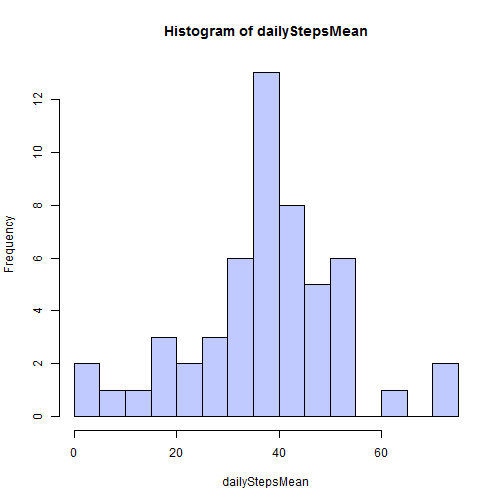
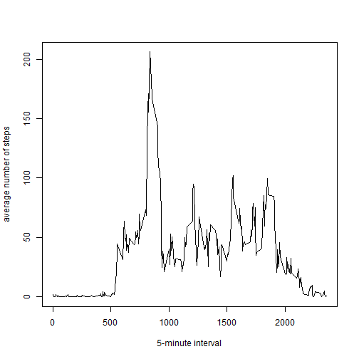
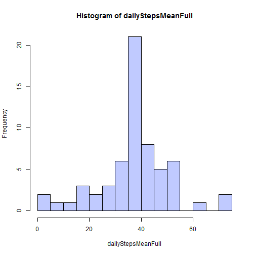

# Reproducible Research: Peer Assessment 1


## Loading and preprocessing the data

```r
library(ggplot2)
library(data.table)
activity <- read.table("activity.csv", header = T, sep = ",", nrows = 17568, 
    colClasses = c("numeric", "factor", "factor"))
activity$interval <- factor(activity$interval, levels = unique(activity$interval))
```


## What is mean total number of steps taken per day?


```r
dailyStepsMean <- by(activity$steps, activity$date, mean, na.rm = T)
dailyStepsMedian <- by(activity$steps, activity$date, median, na.rm = T)
hist(dailyStepsMean, breaks = 11, col = "#c0caff")
```

 


```r
colMeans(cbind(dailyStepsMean, dailyStepsMedian), na.rm = T)
```

```
##   dailyStepsMean dailyStepsMedian 
##            37.38             0.00
```


## What is the average daily activity pattern?

```r
dailyActivity <- by(activity$steps, activity$interval, mean, na.rm = T)
plot(as.numeric(names(dailyActivity)), dailyActivity, type = "l", xlab = "5-minute interval", 
    ylab = "average number of steps")
```

 


```r
names(dailyActivity[which(dailyActivity == max(dailyActivity))])
```

```
## [1] "835"
```


## Imputing missing values
Dataset has some missing values, it's not complete.

```r
NA_data <- sum(!complete.cases(activity))
sum(is.na(activity$date))
```

```
## [1] 0
```

```r
sum(is.na(activity$interval))
```

```
## [1] 0
```

There are 2304 rows with missing information, all missing values located in *steps* column of the database.

```r
dailyStepsMean2 <- by(activity$steps, activity$date, mean, na.rm = F)
dailyMeanWithoutNA <- which(is.na(dailyStepsMean))
dailyMeanWithNA <- which(is.na(dailyStepsMean2))
identical(dailyMeanWithoutNA, dailyMeanWithNA)
```

```
## [1] TRUE
```


Missing values are grouped by days, so to fill missing values I'm calculating the mean for that 5-minute interval 
$$newValue = \mu _{5min}$$

```r
missingData <- which(is.na(activity$steps))
fullActivity <- activity
for (index in missingData) {
    fullActivity$steps[index] = dailyActivity[activity$interval[index]]
}
```


```r
dailyStepsMeanFull <- by(fullActivity$steps, fullActivity$date, mean, na.rm = T)
dailyStepsMedianFull <- by(fullActivity$steps, fullActivity$date, median, na.rm = T)
hist(dailyStepsMeanFull, breaks = 11, col = "#c0caff")
```

 


```r
colMeans(cbind(dailyStepsMeanFull, dailyStepsMedianFull), na.rm = T)
```

```
##   dailyStepsMeanFull dailyStepsMedianFull 
##               37.383                4.474
```


## Are there differences in activity patterns between weekdays and weekends?

```r
Sys.setlocale("LC_TIME", "English")
```

```
## [1] "English_United States.1252"
```

```r
weekend <- c("Sunday", "Saturday")
activityDay <- weekdays(as.Date(fullActivity$date))
fullActivity$weekday <- factor(ifelse(activityDay %in% weekend, "weekend", "weekday"))
```


```r
dt <- data.table(fullActivity[-2])
avgSteps <- dt[, lapply(.SD, mean), by = c("weekday", "interval")]
avgSteps$interval <- as.numeric(as.character(avgSteps$interval))

ggplot(avgSteps, aes(x = interval, y = steps)) + theme_bw() + geom_area(fill = "#c0caff") + 
    geom_line() + labs(x = "5-minute interval", y = "Number of steps") + facet_grid(weekday ~ 
    .)
```

 


