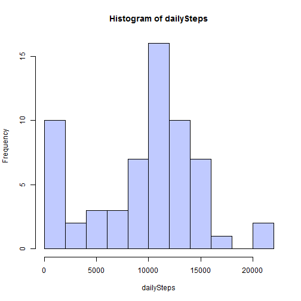
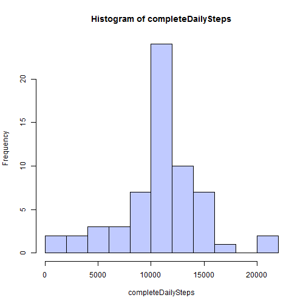
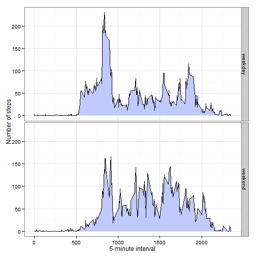

# Reproducible Research: Peer Assessment 1


## Loading and preprocessing the data

```r
library(ggplot2)
library(data.table)
activity <- read.table("activity.csv", header = T, sep = ",", nrows = 17568, 
    colClasses = c("numeric", "factor", "factor"))
activity$interval <- factor(activity$interval, levels = unique(activity$interval))
```


## What is mean total number of steps taken per day?

In order to calculate the mean total number of steps taken per day, I've ignored NA values (na.rm=T) and then used the function *by* to apply sum function to the number of steps recorded subsetted by date.
As date is a factor what I got is the distribution of total number of steps taken by day.


```r
dailySteps <- by(activity$steps, activity$date, sum, na.rm = T)
summary(dailySteps)
```

```
##    Min. 1st Qu.  Median    Mean 3rd Qu.    Max. 
##       0    6780   10400    9350   12800   21200
```

```r
hist(dailySteps, col = "#c0caff", breaks = 8)
```

 


We can see that the daily number of steps taken distribution is unimodal centered in the median 10400,  with an IQR of 6032, ranging between 0 as minimum number of steps taken and 21190 as maximum, with several days with zero steps per day recorded. 
Mean number of steps is 9354 and median is 10400.

## What is the average daily activity pattern?
To check how activity varies through the day I'll make a time series plot of the 5-minute interval (x-axis) and the average number of steps taken, averaged across all days (y-axis).

```r
dailyActivity <- by(activity$steps, activity$interval, mean, na.rm = T)
plot(as.numeric(names(dailyActivity)), dailyActivity, type = "l", xlab = "5-minute interval", 
    ylab = "average number of steps")
```

 

We can see from the plot that there are periods of time with no activity at all, presumibly during sleeping hours, and several activity peaks along the day.

```r
names(dailyActivity[which(dailyActivity == max(dailyActivity))])
```

```
## [1] "835"
```

Maximum activity period is 835 which corresponds to 08:35 in the morning.

## Imputing missing values
Dataset has some missing values, it's not complete.

```r
NA_data <- sum(!complete.cases(activity))
sum(is.na(activity$date))
```

```
## [1] 0
```

```r
sum(is.na(activity$interval))
```

```
## [1] 0
```

There are 2304 rows with missing information, all missing values located in *steps* column of the database.

Missing values are grouped by days, so to fill missing values I'm calculating the mean for that 5-minute interval and saving it in a new data table named *fullActivity*.
$$newValue = \mu _{5min}$$

```r
missingData <- which(is.na(activity$steps))
fullActivity <- activity
for (index in missingData) {
    fullActivity$steps[index] = dailyActivity[activity$interval[index]]
}
```

I'll check again statistics of total number of steps taken per day.

```r
completeDailySteps <- by(fullActivity$steps, fullActivity$date, sum, na.rm = T)
summary(completeDailySteps)
```

```
##    Min. 1st Qu.  Median    Mean 3rd Qu.    Max. 
##      41    9820   10800   10800   12800   21200
```

```r
hist(completeDailySteps, breaks = 11, col = "#c0caff")
```

 

The new distribution of daily number of steps taken is sensibly different from the original. It is unimodal, but is now centered in 10770,  with an IQR of 2991, ranging between 41 as minimum number of steps taken and 21190 as maximum.
Mean number of steps is 10770 and median is also 10770.

Main differences between these values and the first estimates we got is the dissapearece of the peak at 0 steps (which has now add up to the central peak of the distribution) with the consequent narrowing of the distribution IQR.


## Are there differences in activity patterns between weekdays and weekends?
To check for differences in activity patterns between weekdays and weekends I'll first create a new factor variable in a data frame called *fullActivity* with factors "weekend" or "weekday"

```r
Sys.setlocale("LC_TIME", "English")
```

```
## [1] "English_United States.1252"
```

```r
weekend <- c("Sunday", "Saturday")
activityDay <- weekdays(as.Date(fullActivity$date))
fullActivity$weekday <- factor(ifelse(activityDay %in% weekend, "weekend", "weekday"))
```

Then I'll calculate mean number of steps per interval per weekday type  using *data.table* package.

```r
dt <- data.table(fullActivity[-2])
avgSteps <- dt[, lapply(.SD, mean), by = c("weekday", "interval")]
avgSteps$interval <- as.numeric(as.character(avgSteps$interval))

ggplot(avgSteps, aes(x = interval, y = steps)) + theme_bw() + geom_area(fill = "#c0caff") + 
    geom_line() + labs(x = "5-minute interval", y = "Number of steps") + facet_grid(weekday ~ 
    .)
```

 


We can see there are some differences as less activity in the morning during weekends till later and also a different behaviour of the maximum daily activity peak.
Sharpener differences may be hidden due to the process of estimating data, where we didn't take into account if data was for a weekday or for a weekend.
